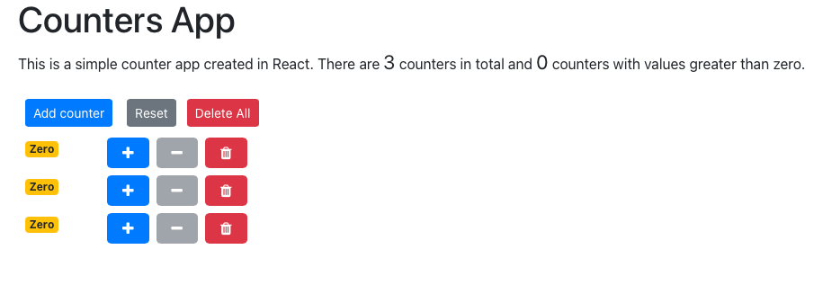

# Counters react app

This is a simple react application with two components namely counter and counters. The counters component is the main component containing the heading, add, reset and delete all buttons. The counter component contains the display of the counter value and buttons at the individual counter level. The counter component raises events onClick which the counters component handles using state and props.

## App functionality

The user has the ability to perform the following actions:

- increment and decrement individual counter
- The decrement button gets disabled when the counter reaches zero
- delete a counter
- reset the value all the counters to zero
- add a new counter
- delete all the counters in a single click

This application keeps a running count of the total number of counters as well as any counters whose value is greater than zero and makes use of:

- Arrow function to bind
- Spread operator to clone the counters array
- setState function to set the state
- object destructuring to simplify the code
- bootstrap css classes for the buttons and alignment of the counters within two columns
- font-awesome icons for the buttons
- React fragment to contain all the components

## Some examples

When there are no counters or upon app load

Click Add counter to add couple of counters

Click plus button to increment the counters (note that the decrement button is disabled for the counters that have the value of zero)

Deleted couple of counters individually

Click on Reset button to reset all the counters to zero

