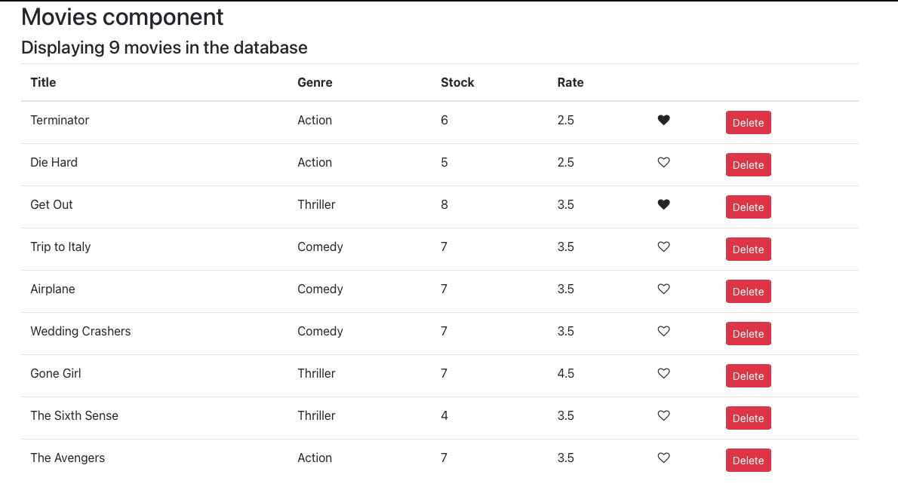

# Movie store react application

Movies component is the main component that displays a list of movies in a tabular format with the option to like and delete the movie. The like button is a stateless functional component that is controlled by the Movies component so it receives the data and raises events through props. The setState is invoked as onClick event when the movie is deleted. The React fragment contains all the elements. The application either displays the list of movies or the message "There are no movies in the database!" if all the movies are deleted.

This is a simple react application making use of the following technologies:

<ul>
    <li>Bootstrap starter template</li>
    <li>Font Awesome icons</li>
    <li>Table view to display the list of movies</li>
    <li>Arrow function, map, filter methods in js</li>
</ul>

List of all the movies

List of all the remaining movies after deleting some of the movies

